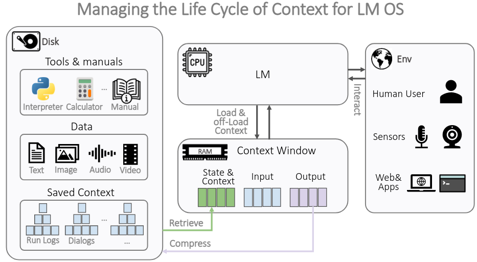
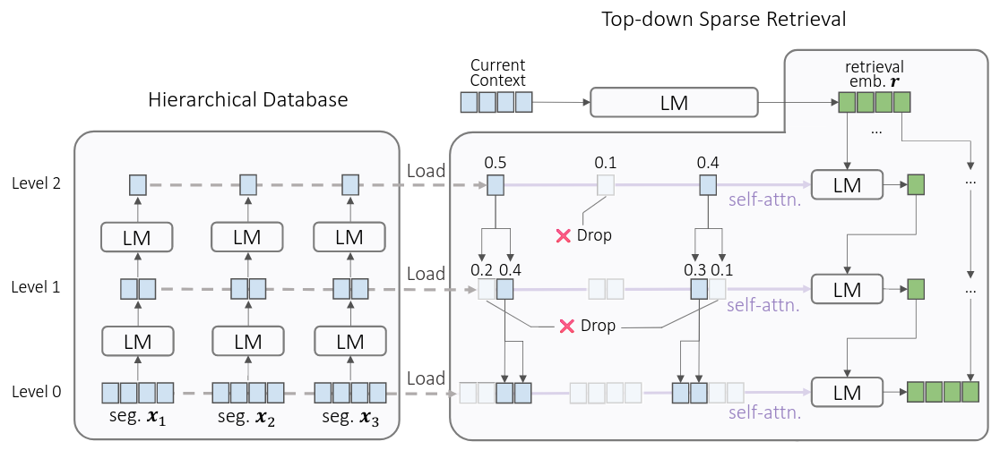

# The Compressor-Retriever Architecture for Language Model OS

[Yuan Yang](https://gblackout.github.io/), [Siheng Xiong](https://dblp.org/pid/277/4221.html), [Ehsan Shareghi](https://eehsan.github.io/) and [Faramarz Fekri](https://fekri.ece.gatech.edu/)

[[Paper](https://arxiv.org/abs/2409.01495)]

## :construction: This repo is under heavy development

# Overview

LLMs nowadays can process multimodal data, long documents, use tools, and browse web. 
Can we integrate all these and make a language model OS? Where the LLM acts as a CPU that processes data stored in 
a context window (RAM).

We argue the the key challenge towards LM OS is managing the life-long context and ensuring statefulness across 
sessions. To address this, we introduce compressor-retriever, a model-agnostic architecture designed for life-long 
context management. Our approach exclusively uses the base model's forward function to compress and retrieve context, 
ensuring end-to-end differentiability. Preliminary experiments demonstrate the effectiveness of this architecture in 
in-context learning tasks, marking a step towards the development of a fully stateful LLM OS.

